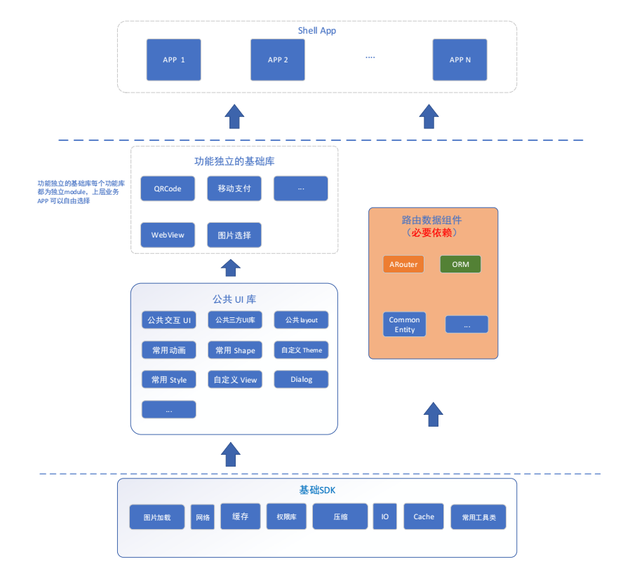
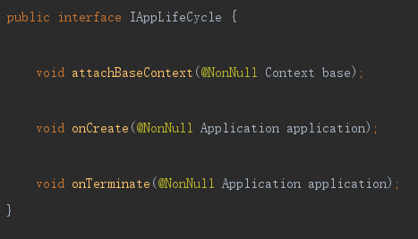
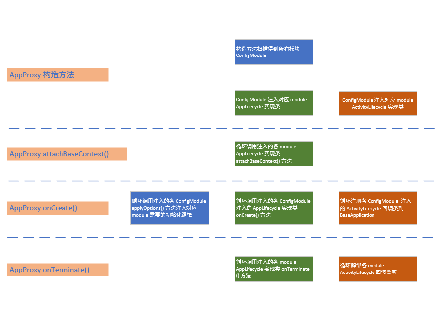
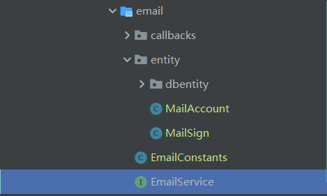

# 结构图

其中路由数据组件为上层业务组件必须要依赖的库，独立功能组件和公共 UI 组件可以根据需求选择是否依赖。公共 UI 组件为应用整体 UI 风格上的公共配置和封装，一般业务组件也都会依赖。基础SDK 为最底层的 SDK 库，所有的业务组件都基于它。顶层的业务 APP 一般按功能模块进行划分譬如：`邮件 App`、`IM App`、`视频 App`
# 为什么要做组件化
一、做组件化主要是随着软件的版本迭代，暴露出一个巨大的问题。同一个 module 下，各种数据跳转之间高度的耦合了，虽然开发要求要注意代码的耦合度，但团队中每个人的经验水平和编码风格都不一样，对这个耦合程度的理解和标准也不一样，随着时间推移模块间的代码会越写相互依赖程度越大。毕竟有时候明明能直接拿过来用，就不会太多的去考虑设计模式。做组件化将相对独立的模块独立出去，达到硬性代码隔离，强制降低模块耦合度的目的。
二、项目随着开发需求的不断迭代会变得越来越庞大，开发过程中项目整编是个很费时的事，组件化之后可以灵活配置选择需要的组件编译，缩短时间
三、多个项目中有的组件是可以共用的，像我经历过的两个项目的网盘模块和邮件模块。未采用组件化方案，移代码移资源太费时费力了。采用组件化方案，直接将 module 导入新的项目，增加对应的路由和 路由Service 方法就能用（前提是项目都采用组件化方案）
# 组件化过程中的几个问题
## 多个组件 module 怎样共用 Application

1、在 BaseApplication 中创建 AppProxy 类，（这个类是 IAppLifeCycle 的一个实现类）。在 BaseApplication 的生命周期方法中调用 AppProxy 的生命周期方法
2、AppProxy 构造函数中扫描 Manifest 文件，扫描类中通过反射拿到每个组件中的实现类。将这些实现类添加到 AppProxy 中的列表中。
3、在生命周期方法中循环第二步中的列表调用列表内各个 module 注入的生命周期代理对象的对应方法
核心处理即在 AppProxy 类中：



各个 module 的代理实现类一定要注册到 manifest 中，否则会扫描不到
```java
        <!--配置 Application-->
        <meta-data
            android:name="com.pandaq.pandamvp.app.lifecycle.LifeCycleInjector"
            android:value="AppInjector"/>
```
这样配置之后我们是没办法手动控制 module 生命周期方法的调用顺序的，因此在 `LifeCycleInjector` 中增加了优先级选项，默认为 0，数字越大越延后加载
```java
    /**
     * priority for lifeCycle methods inject
     *
     * @return priority 0 for first
     */
    int priority();
```
## Activity 及 Fragment 生命周期
- **Activity**：如上图中，与 Application 生命周期注入对应，在 AppProxy 的 `onCreate（）` 方法中将 Activity 生命周期回调注册到 application 中。通过 Application 来管理 Activity 生命周期。
```java
   @Override
    public void onCreate(@NonNull Application application) {
        for (IAppLifeCycle appLifeCycle : mAppLifeCycles) {
            appLifeCycle.onCreate(application);
        }
		// 注册各个 module activity 生命周期回调方法 
        for (Application.ActivityLifecycleCallbacks callbacks : mActivityLifeCycles) {
            application.registerActivityLifecycleCallbacks(callbacks);
        }

    }
	
	@Override
    public void onTerminate(@NonNull Application application) {
        if (mAppLifeCycles != null) {
            for (IAppLifeCycle appLifeCycle : mAppLifeCycles) {
                appLifeCycle.onTerminate(application);
            }
        }
		// app 生命周期结束时注销 activity 生命周期回调 
        if (mActivityLifeCycles != null) {
            for (Application.ActivityLifecycleCallbacks callbacks : mActivityLifeCycles) {
                application.unregisterActivityLifecycleCallbacks(callbacks);
            }
        }
        mAppLifeCycles = null;
        mActivityLifeCycles = null;
        mFragmentLifecycleCallbacks = null;
        AppUtils.release();
    }
```
- **Fragment** ：
各module 内与 Activity 的生命周期注入一样，通过 ILifecycleInjector 的实现类，将 Fragment 生命周期实现类添加到注入列表中，但在 AppProxy 中处理不再是通过注册到 Application 来管理，而是通过一个默认的 Activity生命周期实现类，将这些 fragment 生命周期回调类统一注册到 FragmentManager 中
```java
    private void registerFragmentCallbacks(Activity activity) {
        //注册框架外部, 开发者扩展的 BaseFragment 生命周期逻辑
        for (FragmentManager.FragmentLifecycleCallbacks fragmentLifecycle : mFragmentLifeCycles) {
            if (activity instanceof FragmentActivity) {
                ((FragmentActivity) activity).getSupportFragmentManager().registerFragmentLifecycleCallbacks(fragmentLifecycle, true);
            }
        }
    }
```
描述可能不太容易看懂，具体的代码可以参考 [PandaMvp](https://github.com/PandaQAQ/PandaMvp/tree/master/sdk_core/src/main/java/com/pandaq/appcore/framework/app)
## 组件间的通信
组件中的通信这里采用了 ARouter，具体使用这里不展开，直接去看 [ARouter](https://github.com/alibaba/ARouter) 的文档，几个关键点：
一、页面跳转：.
```java
@Route(path = "/test/activity")
public class YourActivity extend Activity {
    ...
}
```
```java
ARouter.getInstance().build("/test/activity")
            .withLong("key1", 666L)
            .withString("key3", "888")
            .withObject("key4", new Test("Jack", "Rose"))
            .navigation();
```
二、页面值的回传：
```java
// 构建标准的路由请求，startActivityForResult
// navigation的第一个参数必须是Activity，第二个参数则是RequestCode
ARouter.getInstance().build("/home/main").navigation(this, 5);
```
三、Fragment 发现：
```java
// 获取Fragment
Fragment fragment = (Fragment) ARouter.getInstance().build("/test/fragment").navigation();
```
四、跨组件方法调用：
```java
// 声明接口,其他组件通过接口来调用服务, router 组件中定义
public interface EmailService extends IProvider {
    EmailAccount getAccount();
}

// 实现接口对应的业务组件中实现
@Route(path = "/email/emailservice")
public class EmailServiceImpl implements EmailService {

    @Override
    public EmailAccount getAccount() {
    return new EmailAccount();
    }

    @Override
    public void init(Context context) {

    }
}
```
```java
// 调用组件中发现服务再调用方法
public class Test {
    @Autowired(name = "/email/emailservice")
    EmailService emailService;

    public Test() {
    	ARouter.getInstance().inject(this);
		EmailAccount account = emailService.getAccount();
    }

}
```
为避免书写错误等问题，最好定义常量类统一管理路由的 path 并为每个组件使用不同的父路径分组
## 组件间数据实体共享
独立组件间的数据获取传递都通过 Arouter 的服务来完成：


如图所示，每一个独立的业务 module 在 router module 下都有一个自己的文件夹。以 email 组件为例将，其他的业务组件需要获取邮件组件中用户邮件的账号信息和邮件签名，则 email 将自己的账号信息和签名信息类 `MailAccount`、`MailSign` 注册到 router module 中，这样其他组件就能通过对 router module 的依赖识别这两个数据类。A 组件需要从 Email 组件获取 MailAccount。首先 Email 组件要在 router 中的服务 `EmailService` 接口中注册对外暴露 getAccount() 方法,如果获取为异步的，则还需要再 callbacks 中注册一个回调方法。A 中通过接口回调异步拿到 `EmailService` 给他的数据。
## ORM 数据库的增删改查
ORM 数据库，项目采用的是 GreenDao3.0。因为 GreenDao 的初始化和 Tab生成不能跨 module，所以在存储数据时有两种方案：
1、每个业务 module 自己维护数据库。业务组件间需要通信的数据再单独创建类下沉到一个公共库中去。这种方式能保证业务数据的完全独立，但需要多写数据实体类
2、直接把数据实体类都放在一个公共库中，GreenDao 的初始化也放在这个库中。我在项目的实际操作中是将要存入数据库的实体类放入 Router module 中按文件夹分开存放的。
数据库的操作工具类定义在对应的组件内，如 Email 组件，其中的缓存表操作工具类叫 `EmailTb`，通过 EmailTb 的方法对数据库进行增删改查。Email 组件内部增删改查没有任何的阻碍隔离，如果 A组件需要对 Email 表进行增删改查，则需要通过 EmailService 中注册暴露的方法间接的增删改查。如果 Email 未注册暴露对应方法则其他组件不能对 Email 数据库操作
## 资源文件重名问题
```groovy
    resourcePrefix "a_"
```
通过在 gradle 中配置 resourcePrefix 统一为资源文件添加前缀限制，在编译时命名不符合规范编译器将会提示错误。进行组件化改造时这是个体力活，说多了都是泪
## module 组合运行
module 自由组合运行，则需要 module 既要有成为 application 的能力又要有作为 library 的能力。这里我们通过 gradle.pa

# 其他思考
组件化有风险，推进需谨慎。一个非组件化的大型项目要对其进行组件化改造这个过程是漫长而艰巨的，项目中各个模块不可避免的会有各种耦合关系，往往牵一发而动全身，要对它进行组件化改造。首先要对项目进行封装解耦，独立的功能该下沉的下沉，该重写的重写。有时候代码的复用对组件化改造简直是灾难，尤其是本来不属于一个功能模块的界面进行了复用这种。
