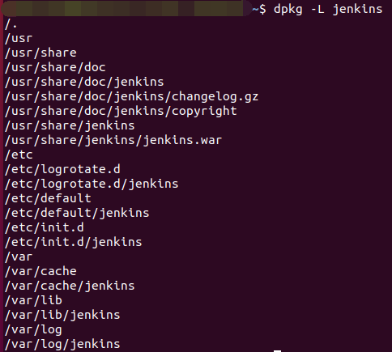
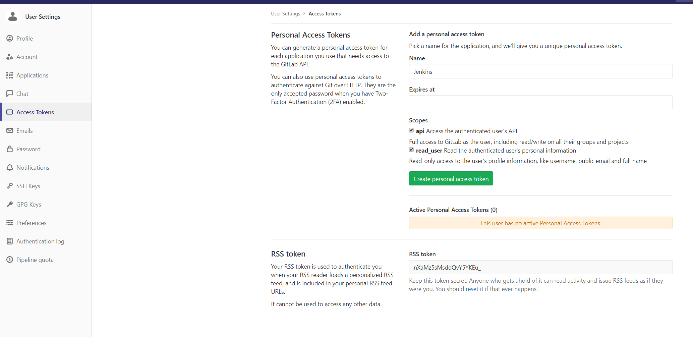
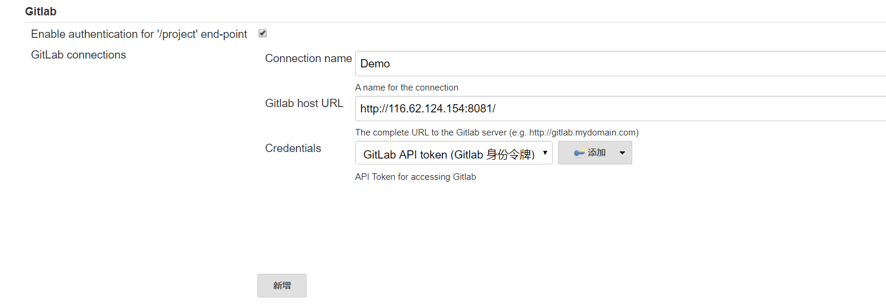
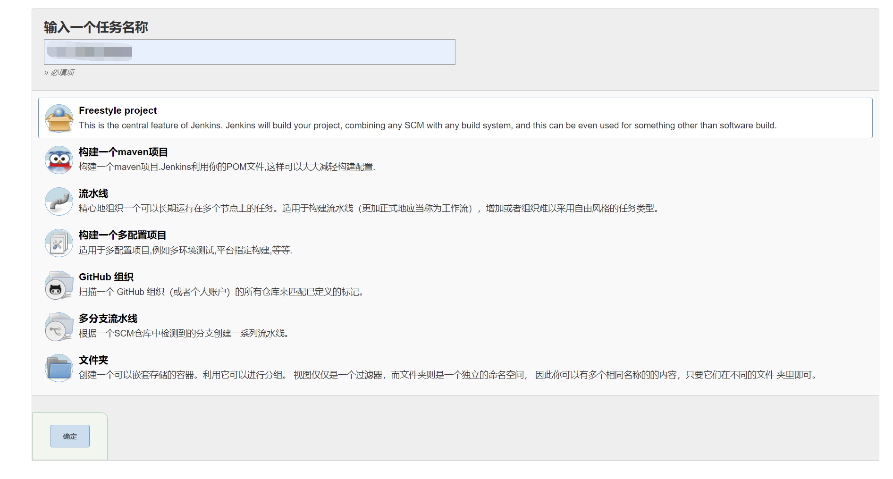
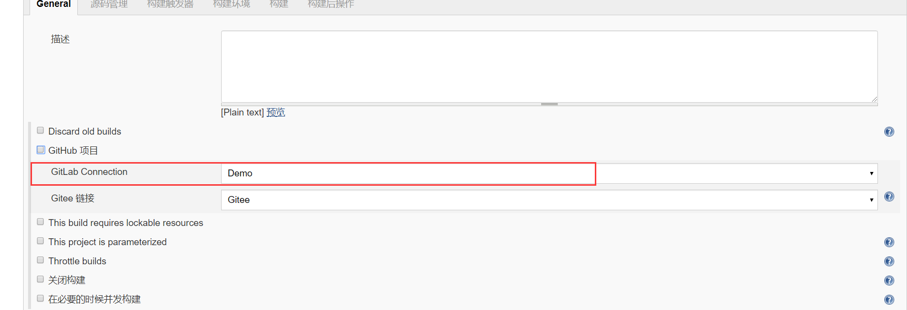

# 安装 jenkins

使用 wget 直接安装。可在[这里](https://mirrors.tuna.tsinghua.edu.cn/jenkins/debian-stable/?C=M&O=D)查看最新版本

- 下载
 ``` cmd
wget https://mirrors.tuna.tsinghua.edu.cn/jenkins/debian-stable/jenkins_2.190.3_all.deb
```
- 安装

```cmd
dpkg -i jenkins_2.190.3_all.deb
```
安装后使用 `dpkg -L jenkins` 命令查看安 jenkins 相关文件如下




配置 webhook 自动构建（需要服务器外网能访问、或者 gitlab 跟 jenkins 都安装在内网）
- 配置
无特殊要求直接使用默认的配置就行，如需要修改配置，打开编辑 default 目录下的 `jenkins` 文件
```cmd
vim /etc/default/jenkins
```
- 启动关闭
启动、关闭、重启分别使用下面三个命令
```cmd
/etc/init.d/jenkins start
/etc/init.d/jenkins stop
/etc/init.d/jenkins restart
```
启动后使用 `/etc/init.d/jenkins status` 查看 jenkins 状态如下则说明启动成功


浏览器打开 "本机 ip+jenkins 配置文件中的端口号（默认 8080）"，即可进入 jenkins 服务器图形界面

##  配置
第一次打开会让配置账户密码，这个自己配置记住就行。然后会推荐安装一些基本插件，为了避免后续插件缺失，按他推荐的安装即可，需要时间可能会有点长。安装好的界面如下：


#### 安装构建需要的插件
1、打开右侧的 Manage Jenkins -> Manage Plugins
2、选择`可选插件` tab 分别搜索安装如下插件再重启 jenkins
```xml
Git  //git 插件
GitLab //gitlab 插件 
Build With Parameters //输入框式的参数
Persistent Parameter //下拉框式的参数
Gradle //gradle 构建插件
```
#### 配置构建资源
##### 一、 配置源码地址凭证
- gitlab 配置 accessToken



- jenkins 新增凭证


- jenkins 管理->系统设置->gitlab 配置源码所在的 gitlab 信息



- 配置 gradle
系统管理->全局工具配置，选择安装 gradle 版本


#### 新建项目
- 点击新建项目，选择 freestyle 即可


- 选择之前配置的 gitlab 连接


- 配置源码
Repository URL,为源码仓库 http 地址，Credentials 点击添加填写 gitlab 的账号密码创建一个凭证即可

 
 
 经过上述配置即完成了基本的构建配置，点击立即构建即可构建默认的 master 配置。可通过参数化构建，譬如选择构建分支，构建类型等。


