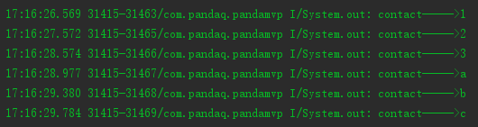
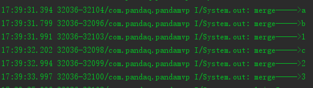
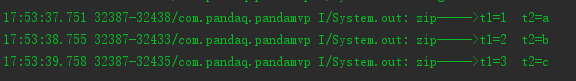

在项目开发中常常会在一个页面中执行多个任务，多线程异步执行任务时哪个任务先结束出结果这些并不好控制，譬如要进行几个并发的网络请求在都拿到结果后需要对数据进行处理，希望的是用户只感知一次数据加载，如果不能做到这样，反馈到用户界面的体验也就不好了。通过 RxJava 的合并操作符我们能够很方便的应对这些情况。

# 常用的几个合并操作符
我们先创建如下三个不同数据类型的 observable 作为示例数据
``` java
	// 先创建三个不同类型的示例 observable
    private val observable = Observable.fromArray(1, 2, 3)
            .concatMap(object : Function<Int, ObservableSource<Int>> {
                override fun apply(t: Int): ObservableSource<Int> {
                    return Observable.just(t).delay(1000, TimeUnit.MILLISECONDS)
                }
            })

    private val observable1 = Observable.just("a", "b", "c")
            .concatMap(object : Function<String, ObservableSource<String>> {
                override fun apply(t: String): ObservableSource<String> {
                    return Observable.just(t).delay(400, TimeUnit.MILLISECONDS)
                }
            })
			
	private val observable2 = Observable.fromArray(1.0f, 2.0f, 3.0f)
            .concatMap(object : Function<Float, ObservableSource<Float>> {
                override fun apply(t: Float): ObservableSource<Float> {
                    return Observable.just(t).delay(1000, TimeUnit.MILLISECONDS)
                }
            })
```
## concat()
`concat()` 操作符将多个 Observable 按先后顺序进行合并，当合并的 Observable<T> 泛型类型不一致时,事件流中的对象类型只能使用 `Object`(java),`Any`(kotlin)。通过如下示例代码可以直观的看到 concat 后事件的发送顺序：
``` java
        Observable.concat(observable, observable1)
                .subscribe(object : AppCallBack<Any>() {
                    override fun success(data: Any?) {
                        println("contact----->$data")
                    }

                    override fun fail(code: Long?, msg: String?) {

                    }

                    override fun finish(success: Boolean) {
                        merge()
                    }

                })
```
得到的输出结果为：



observable 发送 1、2、3 的时间间隔是大于 observable1发送 a、b、c 的间隔的，但输出结果为 123 打印完毕后再打印 abc 。这说明 concat 操作符是线性有序的，要等前一个 observable 发送完毕后才会处理下一个 observable。当我们需要多个接口的返回数据按顺序进行处理时可以使用 concat 操作符合并请求。

**多于四个 observable 的合并**:
两种方式
- `concat()` 传入一个 `Iterable<? extends ObservableSource<? extends T>` 对象
- `concatArray()`  传入一个 Observable 数组。
## merge()
`merge()` 操作符将多个 Observable 无序合并，当合并的 Observable<T> 泛型类型不一致时,事件流中的对象类型只能使用 `Object`(java),`Any`(kotlin)。
``` java
        Observable.merge(observable, observable1)
                .subscribe(object : AppCallBack<Any>() {
                    override fun success(data: Any?) {
                        println("merge----->$data")
                    }

                    override fun fail(code: Long?, msg: String?) {

                    }

                    override fun finish(success: Boolean) {
                        zip()
                    }

                })
```
得到的输出结果为：


abc 与 123 是按照时间先后顺序交错进行输出的，说明 `merge()` 后事件的发送是并发的无序的，先发送先处理

**多于四个 observable 的合并**:
两种方式
- `merge()` 传入一个 `Iterable<? extends ObservableSource<? extends T>` 对象
- `mergeArray()`  传入一个 Observable 数组。
## zip()
上面的两种合并都是单个事件 item 订阅监听，如果想合并的事件 item 都接收到数据时处理这两个事件数据就需要使用 zip() 操作符。
``` java
        Observable.zip(observable, observable1, object : BiFunction<Int, String, String> {
            override fun apply(t1: Int, t2: String): String {
                return "t1=$t1  t2=$t2"
            }
        }).subscribe(object : AppCallBack<String>() {
            override fun success(data: String?) {
                println("zip----->$data")
            }

            override fun fail(code: Long?, msg: String?) {

            }

            override fun finish(success: Boolean) {

            }

        })
```
得到的输出结果为：


使用 zip 合并时，会等待每一次的合并项都发送完毕后再发送下一轮的事件。当我们需要从两个数据源拿数据，但是需要统一合并显示时可以使用 zip 操作符对事件流进行合并。

**多个 observable 的合并**:
`zip()` 的多事件合并就有点厉害了，支持九个 Observable 按数据类型合并，除了两个观察者对象合并时 zipper 是 `BiFunction` 其他的为 `FunctionX` ,X 为合并个数。如果多于九个观察者对象合并，与上面两种合并一样可以使用 `zipArray()` 进行合并，但是合并后的观察结果是一个 Object 数组对象，需要自己判断数据类型

# 结语
除了以上的创建 Observable 对象级别的合并操作符，还有一些事件流中的操作符，譬如第一段代码中的 `concatMap` ，在事件流前面添加其他事件的 `startWith()` 等。还是比较完善的
