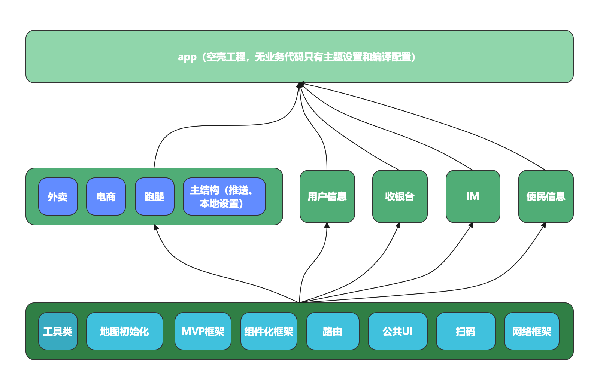

# 整体架构

# 组件说明
## Base
项目基础依赖，在各个子组件工程中已经配置好 maven 依赖关系。子组件开发时无需关心，直接使用即可。
## 主工程
包含电商、外卖、跑腿和 app 层面的一些功能模块，为自研的主工程。
## 用户信息组件
包含 APP 的注册登陆、用户设置、用户信息、密码等与用户身份信息相关的功能；独立组件开发，与业务剥离。
## 收银台组件
支付收银台组件，其他功能模块都不单独做支付功能。需要支付时，带参数通体跳转到此收银台组件进行支付相关的业务
## IM 聊天组件
单独的 IM 聊天组件，包括其他端的 APP 也可直接引入组件依赖
## 便民信息组件
包含整个便民信息的发布和浏览，以及用户的关注收藏等业务。整体打包给外包团队按照开发规范进行开发，验收完毕后以依赖包的形式接入主工程
# 资源文件命名规范
各个组件资源文件命名规则校验配置在了各组件的 build.gradle 文件中。各组件在创建导入资源文件后，命名时需要添加对应的前缀。避免合并打包时文件命名冲突。
# MVP 框架
整体框架关系如下图所示
# App 生命周期注入
各组件在开发时可能需要一些三方 SDK 在 Application 中初始化，但整个应用的 Application 只有一个，因此在 Base 组件 BaseApp 中添加了对各个组件生命周期类的扫描注入，因此子组件只需要在 `xxx.base.lifecycle.AppLifecycle` 类的生命周期方法中实现自己的初始化业务即可
```kotlin
class AppLifecycle : IAppLifeCycle {
    override fun attachBaseContext(base: Context) {

    }

    override fun onCreate(application: Application) {
        val options = EMOptions()
        // 默认添加好友时，是不需要验证的，改成需要验证
        options.acceptInvitationAlways = false
        // 是否自动将消息附件上传到环信服务器，默认为True是使用环信服务器上传下载，如果设为 false，需要开发者自己处理附件消息的上传和下载
        options.autoTransferMessageAttachments = true
        // 是否自动下载附件类消息的缩略图等，默认为 true 这里和上边这个参数相关联
        options.setAutoDownloadThumbnail(true)
        //初始化
        EMClient.getInstance().init(application, options)
        //在做打包混淆时，关闭debug模式，避免消耗不必要的资源
        EMClient.getInstance().setDebugMode(BuildConfig.IN_DEBUG)
        EMClient.getInstance().addConnectionListener(object : EMConnectionListener {
            override fun onConnected() {
                PLogger.d("")
            }

            override fun onDisconnected(errorCode: Int) {

            }

        })
    }

    override fun onTerminate(application: Application) {

    }
}
```
# 网络请求
参考 [RxPanda 网络请求封装，使用文档](https://github.com/PandaQAQ/RxPanda/blob/master/README.md)，基于 Retrofit + RxJava2 进行封装。
### 注意事项
1、为了方便管理和组件合并，要求解析壳即接口返回的数据封装结构和成功 code 码必须所有组件一致，无特殊需要，子组件无需关心，主工程中将会统一配置。如结构确实有特殊需要，可参考文档单个接口注解配置解析类
```
{
  "code": "C00001", //业务 code 码，作为成功失败的判断依据
  "description": "成功", //请求附带信息
  "resultMap": { // 数据对象
  },
  "success": true
}
```

# 三方库依赖规范
- 1、先检查[远程配置文件](http://3786p8r681.qicp.vip:13160/huxinyu/maven/blob/master/config.gradle)中是否有这个依赖，如果有使用
```gradle
api rootProject.ext.dependencies["xxxx"] 进行依赖导入
```
- 2、如远程配置文件中没有对应的依赖则使用 `implementation` 编译时依赖，并邮件通知管理员在主工程中新增对应依赖

# 公用 UI 规范
为了保证组件开发后，合并打包后各子业务组件界面风格统一，因此会根据 UI 部门出的规范进行一些通用 UI 的限制
### 屏幕适配
屏幕适配采用今日头条的适配方案，使用 [AutoSize 框架](https://github.com/JessYanCoding/AndroidAutoSize/blob/master/README-zh.md)框架已经在基础包中设置了尺寸，使用时蓝湖 @1尺寸对应 hdpi @2尺寸对应 xhdpi @3尺寸对应 xxhdpi。使用自定义模拟器做布局预览，模拟器屏幕参数为 ：5.8 寸 ，2436 x 1125 分辨率
 ### 主题色、文本颜色、字体大小
 基础数值将会与 UI 设计部门沟通后配置到 base 组件的 color 中，命名以 res_xxx 开头。如组件开发时得到的图稿数值未遵从规范，请及时反馈
### 全局的界面加载、异常（空页面、错误页面）
正常使用 StateLayout 进行，方便所有组件统一配置状态页面和加载动画。使用方式如下：
```kotlin
  // 1、Activity/Frament 继承自 BaseActivity/BaseFragment 或其子类，实现 IView 的子类接口
@Route(path = "${RouteRoot.INFO}/InfoHomeFragment")
class InfoHomeFragment : InfoBaseFragment<InfoHomePresenter, InfoFragmentHomeBinding>(),
    IInfoHomeView {

    // 2、重写此方法,返回 true 表示此页面需要使用 StateLayout
    override fun showState(): Boolean {
        return true
    }

    override fun initVariable() {

    }

    override fun initView() {
        binding.tvUserId.text = RouteUtil.getUserId()
    }

    override fun loadData() {
        
    }

}
```
```kotlin
// Presenter 中通过以下三个方法调用控制状态
mView?.showLoading()
mView?.showContent()
mView?.showEmpty()
mView?.showError(showErrorPage: Boolean, errMsg: String? = null)
```
 
### 页面部分区域状态加载
 通过上述方式设置的状态 View 为全页面的覆盖，如需要部分区域显示状态 View，则在该页面的对应布局外层套一个`StateLayout`，其他设置与上述方式一致，额外增加：

``` kotlin
    override fun initView() {
		//界面初始化后调用 setStateLayout 将添加的状态 View 与 IView 进行关联
        setStateLayout(binding.stateLayout)
		x
		x
		x
	}
```
### 列表页面刷新、加载更多
base 组件中 RefreshRecyclerView 类将 SmartRefreshLayout 和 RecyclerView 组合到了一起，并配置了刷新、加载、空 list 等 UI 风格的配置。因此为了保持风格统一，要求列表使用此控件进行展示
```kotlin
  // 1、Activity/Frament 继承自 BaseRefreshActivity/BaseRefreshFragment 或其子类/// 1、Activity/Frament 继承自 BaseRefreshActivity/BaseRefreshFragment 或其子类，实现 IListView 的子类接口
@Route(path = "${RouteRoot.INFO}/InfoHomeFragment")
class InfoHomeFragment : InfoBaseRefreshFragment<InfoHomePresenter, InfoFragmentHomeBinding>(),
    IInfoHomeView {

    // 2、重写此方法,返回 true 表示此页面需要使用 StateLayout。首次加载的时候需要覆盖页面动画跳动进行加载。
    override fun showState(): Boolean {
        return true
    }

    override fun initVariable() {

    }

    override fun initView() {
        binding.tvUserId.text = RouteUtil.getUserId()
    }

    override fun loadData() {
        
    }

	// 关联 RefreshRecyclerView 控件与 IListView 接口
    override fun bindRefresh(): RefreshRecyclerView = binding.rrvInfoIndex

}
```
```kotlin
// Presenter 中通过以下四个方法调用控制状态
mView?.showLoading()
mView?.showContent()
mView?.showEmpty()
mView?.showError(showErrorPage: Boolean, errMsg: String? = null)
```
# 数据库持久化
使用 room 数据库，各个组件单独维护自己的库和数据，数据库名称需要加上 `build.gradle` 中配置的资源前缀
# 路由和跨组件路由
## 无参数跳转
无参数跳转，直接根据路由表对应组件对应页面的路由 path，使用 ARouter 跳转
#### 样例场景
- 跳转无需携带信息的各个页面
## 带参数跳
带参数跳转，全部使用路由服务方法进行跳转。目标组件应先向 base 包中注册服务接口方法并在自己组件内实现服务方法，使用组件在本组件内通过路由服务方法接口进行跨组件调用。
#### 样例场景
- 向收银台组件发起支付，需传入账单 id 等业务相关的 id


  


