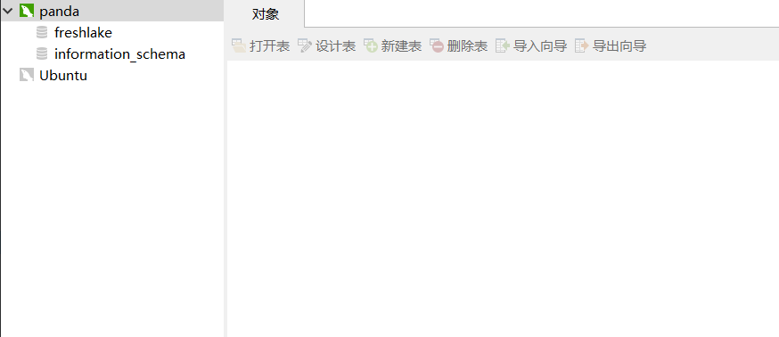

1、dpkg -l | grep mysql 检查是否安装了 mysql 

2、安装 mysql "apt install mysql-server"


3、检查状态如下则表示安装成功

4、mysql -u root -p 登录
默认 root 用户，无初始密码。连按回车即可登录

5、可以查看到数据库列表


6、安装 mysql 密码插件,并修改 root 用户密码


```cmd
root@VM-0-8-ubuntu:~# mysql_secure_installation

Securing the MySQL server deployment.

Connecting to MySQL using a blank password.

VALIDATE PASSWORD PLUGIN can be used to test passwords
and improve security. It checks the strength of password
and allows the users to set only those passwords which are
secure enough. Would you like to setup VALIDATE PASSWORD plugin?

Press y|Y for Yes, any other key for No: y

There are three levels of password validation policy:

LOW    Length >= 8
MEDIUM Length >= 8, numeric, mixed case, and special characters
STRONG Length >= 8, numeric, mixed case, special characters and dictionary                  file

Please enter 0 = LOW, 1 = MEDIUM and 2 = STRONG: 0
Please set the password for root here.

New password: 

Re-enter new password: 

Estimated strength of the password: 50 
Do you wish to continue with the password provided?(Press y|Y for Yes, any other key for No) : y
By default, a MySQL installation has an anonymous user,
allowing anyone to log into MySQL without having to have
a user account created for them. This is intended only for
testing, and to make the installation go a bit smoother.
You should remove them before moving into a production
environment.

Remove anonymous users? (Press y|Y for Yes, any other key for No) : y
Success.


Normally, root should only be allowed to connect from
'localhost'. This ensures that someone cannot guess at
the root password from the network.

Disallow root login remotely? (Press y|Y for Yes, any other key for No) : y
Success.

By default, MySQL comes with a database named 'test' that
anyone can access. This is also intended only for testing,
and should be removed before moving into a production
environment.


Remove test database and access to it? (Press y|Y for Yes, any other key for No) : y
 - Dropping test database...
Success.

 - Removing privileges on test database...
Success.

Reloading the privilege tables will ensure that all changes
made so far will take effect immediately.

Reload privilege tables now? (Press y|Y for Yes, any other key for No) : y
Success.

All done! 
```
7、创建一个新的用户
```cmd
// '用户名'@'指定ip'（%指所有ip均可访问） 
mysql> create user 'panda'@'%' identified by 'panda';
```
8、创建数据库
```cmd
mysql> create database freshlake;
```
9、授权用户 panda 获得 freshlake 数据库的所有权限
```cmd
grant all privileges on freshlake.* to 'panda'@'%';
```
10、配置数据库允许远程访问
现在配置mysql允许远程访问，首先编辑 /etc/mysql/mysql.conf.d/mysqld.cnf 配置文件：

vim /etc/mysql/mysql.conf.d/mysqld.cnf

注释掉bind-address          = 127.0.0.1

Navicat 连接腾讯云服务器上的数据库

// ssh 配置连接到服务器账户

// 使用数据库密码连接数据库

// 根据配置，panda 用户只能看到 freshlake 数据库
